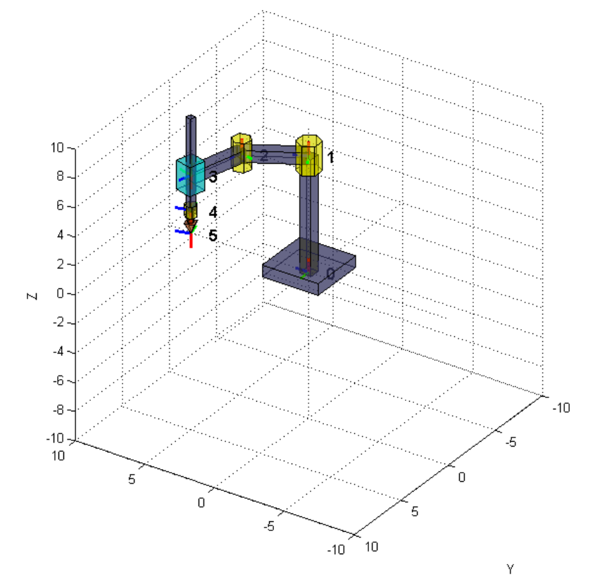

# SCARA Robot Visualizer

MATLAB script that shows motion across different trajectoris of a SCARA robot.
User can choose one of 5 different modes of operation in `SCARA_VISUALIZER.m` code (`mode` variable).

For further description and screenshots consult [this pdf](./SCARA_Forward_and_Inverse_Kinematics.pdf).

## What I have learnt?

* using homogeneous matrices to position and orient object in 3D space
* SCARA robot's forward and inverse kinematics
* `matlab`: drawing 3D solids, coordinate systems
* `matlab`: programming and animating motion according to parametric curves
* `matlab`: using switch to program different modes of program execution

## References

* [1] Jezierski E.: Dynamika robotów, Wydawnictwa Naukowo-Techniczne, 2006
* [2] http://www.mathworks.com/help/rptgenext/ug/documentation.html
* [3] www.wolframalpha.com (parametric curves)
